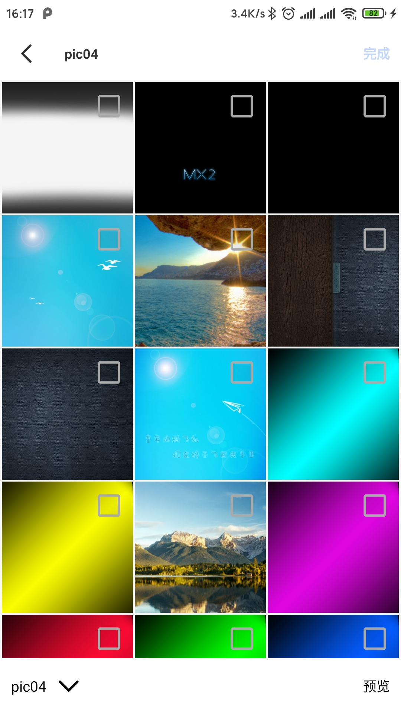
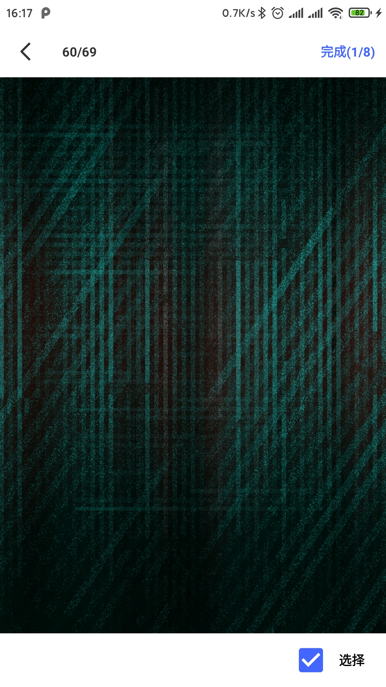

# MediaPicker
Android本地媒体文件选择器。支持图片和音视频文件的单选和多选，支持预览缩放，支持动态图的预览（GIF和APNG，例如gif下载中断导致的图片信息不完整也不影响预览）。

效果图

## 依赖
gradle依赖

    dependencies {
        // 只使用选择，没有预览功能
        implementation 'com.chends.picker:picker:0.1.0-beta01'
        // 使用预览，包含选择和预览
        implementation 'com.chends.picker:picker_preview:0.1.0-beta01'
        // 使用gif decoder，在预览时可以对gif图片进行缩放
        implementation 'com.chends.picker:third_decoder_gif:0.1.0-beta01'
        // 使用apng decoder，在预览时可以对apng图片进行缩放
        implementation 'com.chends.picker:third_decoder_apng:0.1.0-beta01'
    }
    
## 使用

在Activity或Fragment中

    MediaPicker.with(this)
        // 选择的类型
        .addTypes(MimeType.all())
        // 最多选择数量
        .maxNum(9)
        // 列表每行数量
        .setSpanCount(4)
        // 已经选择的数量
        .chooseList(choose)
        // 图片加载类
        .setLoader(new MyMediaLoader())
        // 启动选择
        .start(chooseCode);
 
启动选择前需要自己处理存储卡读写权限

处理返回结果

    @Override
    protected void onActivityResult(int requestCode, int resultCode, Intent data) {
        super.onActivityResult(requestCode, resultCode, data);
        if (resultCode == RESULT_OK && requestCode == chooseCode && data != null) {
            Bundle bundle = data.getExtras();
            if (bundle != null) {
                List<String> list = MediaPicker.getData(data.getExtras());
                // list中是选择文件的绝对路径
            }
        }
    }
    
关于自定义图片加载，请参考[示例代码](./sample/src/main/java/com/chends/media/picker/sample/MyMediaLoader.java)

## License

    Copyright 2017 chends

    Licensed under the Apache License, Version 2.0 (the "License");
    you may not use this file except in compliance with the License.
    You may obtain a copy of the License at

       http://www.apache.org/licenses/LICENSE-2.0

    Unless required by applicable law or agreed to in writing, software
    distributed under the License is distributed on an "AS IS" BASIS,
    WITHOUT WARRANTIES OR CONDITIONS OF ANY KIND, either express or implied.
    See the License for the specific language governing permissions and
    limitations under the License.
